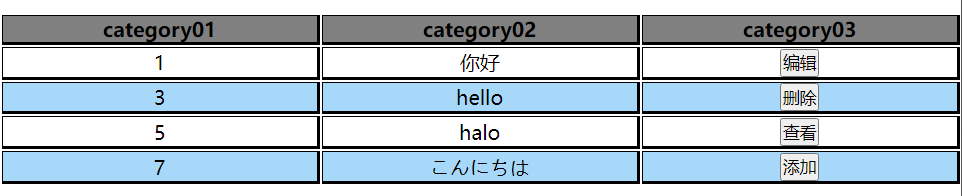

# WebTable



介绍：一个简单的由JavaScript实现的网页动态表格，可支持显示文本和按钮。

使用方法：

```html
<table id="app">

    </table>

    <script>
        var test_data = {
            header: [
                {
                    name: 'category01',
                    type: 'number'
                },
                {
                    name: 'category02',
                    type: 'text'
                },
                {
                    name: 'category03',
                    type: 'button'
                }
            ],
            content: [
                [1, '你好', { btn_name: '编辑', btn_type: 'edit' }],
                [3, 'hello', { btn_name: '删除', btn_type: 'del' }],
                [5, 'halo', { btn_name: '查看', btn_type: 'view' ,func:function(){alert('hahaha')}}],
                [7, 'こんにちは', { btn_name: '添加', btn_type: 'add' }]
            ]
        }

        table = new WebTable(test_data, 'app')
        table.init()
    </script>
```

见代码，WebTable类需要传入两个参数，data和id，data的结构如上（test_data），需要说明的是目前header中的type只支持number,text,button三个参数，content中需要说明的是button部分，该部分的结构是

```javascript
{
    btn_name: '编辑',		//必须，给按钮添加文本
    btn_type: 'edit',	//必须，为确定按钮类型，当前支持edit(编辑),del(删除),add(添加),view(查看)四种类型的按钮
    func:function(){alert('hahaha')	//可选，这是该按钮对应的绑定事件，如果不填则默认会执行alert()
}
```

另一个参数id是对应了table的id，在使用时，需要先创建一个table标签和对应id，然后再实例化WebTable类时，id就是该table标签的id。


ps：WebTable的参数如下

```javascript
WebTable(data, id,
    tr_th_class = 'raw_tr_th',
    tr_td_class = 'raw_tr_td',
    td_class = 'block_td',
    th_class = 'block_th')
```

其中表头行的class为tr_th_class = 'raw_tr_th'，单元格的class为th_class = 'block_th'

表体行的class为tr_td_class = 'raw_tr_td'，列的class默认为"col_<列号>"，列好从0开始，单元格的class为td_class = 'block_td'。


可以通过2959243019@qq.com联系我~
